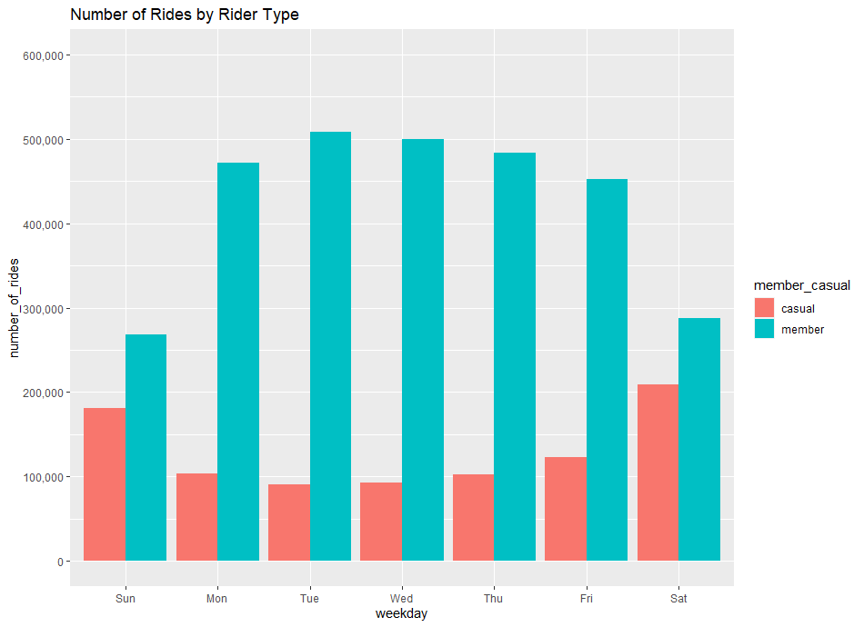
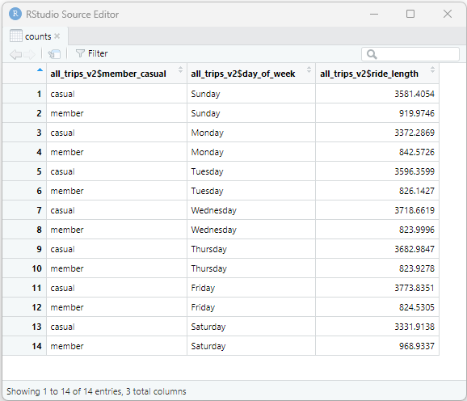
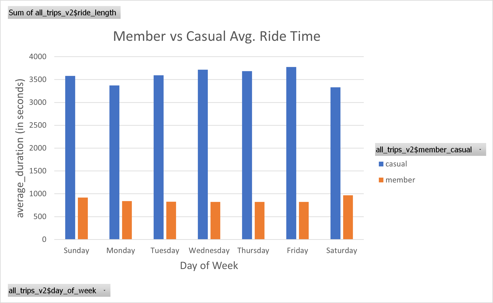

# Case Study: How Does a Bike-Share Navigate Speedy Success?

## Scenario
You are a junior data analyst working in the marketing analyst team at Cyclistic, a bike-share company in Chicago. The director of
marketing believes the company’s future success depends on maximizing the number of annual memberships. Therefore, your
team wants to understand how casual riders and annual members use Cyclistic bikes differently. From these insights, your team will
design a new marketing strategy to convert casual riders into annual members. But first, Cyclistic executives must approve your
recommendations, so they must be backed up with compelling data insights and professional data visualizations.

Three questions will guide the future marketing program:

1. How do annual members and casual riders use Cyclistic bikes differently?
2. Why would casual riders buy Cyclistic annual memberships?
3. How can Cyclistic use digital media to influence casual riders to become members?

You have been assigned the first question to answer: How do annual members and casual riders use Cyclistic bikes differently?

You will produce a report with the following deliverables:

1. A clear statement of the business task
2. A description of all data sources used
3. Documentation of any cleaning or manipulation of data
4. A summary of your analysis
5. Supporting visualizations and key findings
6. Your top three recommendations based on your analysis

# Ask
The business task: Cyclistic aims to maximize annual memberships, so we need to understand the differences in bike usage between annual members and casual riders.

Some questions to ask:

- How do annual members and casual riders use Cyclistic bikes differently?
- Are there specific days of the week when annual members or casual riders tend to use the service more frequently?
- What are the typical trip purposes for annual members and casual riders? Are annual members more likely to use the service for commuting, while casual riders use it for leisure or tourism?
- What are the key factors that might lead casual riders to purchase annual memberships?
- How can digital media be leveraged to encourage casual riders to become members?
- Where does the data come from, and what is its original source?
- What is the scope of the data? What specific time periods does it cover?

Asking these questions is essential for gaining a comprehensive understanding of the task at hand. They help clarify objectives, identify potential challenges, and ensure that the analysis is aligned with the specific goals and requirements of the project.

# Prepare 
For this analysis, I obtained the data from the Divvy dataset, which covers the periods Q2-2019, Q3-2019, Q4-2019, and Q1-2022. I imported this dataset into RStudio for analysis. The dataset's origin is credited to the case study titled "'Sophisticated, Clear, and Polished’: Divvy and Data Visualization," authored by Kevin Hartman. You can access the original case study at [Sophisticated, Clear, and Polished](https://artscience.blog/home/divvy-dataviz-case-study). 

# Process
I chose R Studio for my data analysis because it provides a powerful and flexible environment for data manipulation, visualization, and statistical analysis. Additionally, I used specific R packages, including Tidyverse, Lubridate, and ggplot2, because they offer a comprehensive set of tools for data cleaning, transformation, and visualization.

I have implemented various data cleaning steps to ensure the data's cleanliness, including:

- Comparing each column across the quarterly files to ensure consistency in column names.
- Joining the separate quarterly files into one cohesive dataset.
- Inspecting the data frames for inconsistencies and making necessary adjustments.
- Converting data types to ensure proper stacking.
- Removing unnecessary columns.
- Inserting calculated fields, such as date, month, day, and year of each ride.
- Identifying and removing "bad" data points.

I conducted descriptive analysis and created visualizations to extract valuable insights. Finally, I exported the summary as a CSV file for further analysis.

# Analyze

#### Number of Rides
To explore how annual members and casual riders use Cyclistic bikes differently, I conducted an analysis in R Studio. This analysis focused on creating a chart that displays the number of riders categorized by their type (member or casual) for each day of the week. The chart's y-axis was adjusted to show values between 0 and 600,000, with labels in increments of 100,000. When observing the x-axis, which represents weekdays, it becomes clear that the chart highlights the changes in ride counts over the course of the week.

In this chart, bars are organized by rider type, with each bar representing the number of rides for a specific weekday. The bars are stacked, providing an overview of the total rides for each day, and different colors within each bar indicate how these rides are distributed between members and casual riders. The analysis uncovered noticeable usage patterns: members tend to maintain a relatively stable pattern during weekdays, indicating a possible focus on daily commuting. Conversely, casual riders exhibit higher ride counts on weekends, particularly on Saturday and Sunday, suggesting a preference for recreational or leisurely bike rides. This visual representation offers insights into the distinct behaviors of member and casual riders when using the bike-sharing service throughout the week, highlighting the prominent weekend usage among casual riders.

#### Average Duration of Ride

I utilized an alternative approach to examine the distinctions in how annual members and casual riders utilize Cyclistic bikes. Specifically, I aimed to gain a comprehensive understanding of their respective bike usage patterns throughout the week. This analysis involved calculating the average duration of rides for each day of the week, categorized by rider type (annual members and casual riders). Subsequently, I exported the summary data to an Excel spreadsheet, where I leveraged a pivot table to conduct a more in-depth analysis and create visualizations.

 

Based on the analysis of how annual members and casual riders use Cyclistic bikes differently, several key trends and insights can be observed:

- Usage Patterns Throughout the Week: Annual members tend to use Cyclistic bikes more consistently throughout the weekdays, with relatively stable ride counts from Monday to Friday. This pattern suggests that annual members may primarily use the service for daily commuting or regular transportation needs.

- Weekend Usage: In contrast, casual riders exhibit a different pattern, showing a higher number of rides during weekends, specifically on Saturdays and Sundays. This trend implies that casual riders might be using the service more for leisure or recreational purposes during weekends, such as sightseeing or outdoor activities.

- Duration of Rides: When comparing the average ride duration between annual members and casual riders, it's evident that the average ride duration is generally consistent for both groups throughout the week. This suggests that the duration of rides doesn't vary significantly between the two rider types.

Annual members and casual riders use Cyclistic bikes differently in terms of usage patterns throughout the week. While annual members maintain a consistent pattern for daily commuting, casual riders show a preference for weekend leisure activities.  This distinction in usage patterns underlines the importance of Cyclistic tailoring its marketing and services to cater effectively to both annual members' commuting needs and casual riders' weekend leisure pursuits. 

# Share

I successfully addressed the question of how annual members and casual riders utilize Cyclistic bikes differently. Our data analysis unveiled clear usage patterns, with annual members predominantly relying on the service for weekday commuting, while casual riders showed a preference for weekend leisurely rides. These findings directly align with the initial inquiry about divergent bike usage between these two rider categories.

This comprehensive report, crafted through a combination of R for data cleaning, analysis, and visualization, highlights the disparities in bike usage patterns between annual members and casual riders. Additionally, we harnessed spreadsheet pivot tables to delve deeper into the data, extracting valuable insights. The entire process was meticulously documented using R Markdown to ensure accessibility and transparency in conveying our results.

# Act
Our analysis has led us to several important findings. Firstly, it's clear that annual members primarily utilize Cyclistic bikes for their weekday commutes, while casual riders are more inclined toward weekend leisure rides. Secondly, these insights can be put into action by the marketing team to craft targeted weekend promotions aimed at attracting a larger casual rider audience. 

To increase casual rider engagement, we propose the following strategies:

1. Weekend Events: Organize weekend biking events or guided tours targeted at casual riders. Collaborate with local businesses or tourist attractions to create appealing weekend experiences.

2. Loyalty Programs: Implement a weekend-focused loyalty program that rewards casual riders for frequent weekend rides. Offer incentives such as free weekend rentals or exclusive weekend ride access.

3. User-Generated Content: Encourage casual riders to share their weekend biking adventures on social media using a specific hashtag. Feature the best posts on Cyclistic's website and social channels to inspire others.

# Summary
In this comprehensive analysis, we investigated how annual members and casual riders utilize Cyclistic bikes differently. Our data-driven approach revealed distinct usage patterns: annual members primarily use the service for weekday commuting, while casual riders favor weekend leisure rides. These insights provide a foundation for a targeted marketing strategy to convert casual riders into annual members. Our next steps involve implementing strategies such as organizing weekend events, launching loyalty programs with weekend rewards, and promoting user-generated content on social media to engage casual riders effectively. This analysis, conducted using R, demonstrates the importance of tailoring Cyclistic's services to meet the diverse needs of these two rider categories and lays the groundwork for future marketing success.
